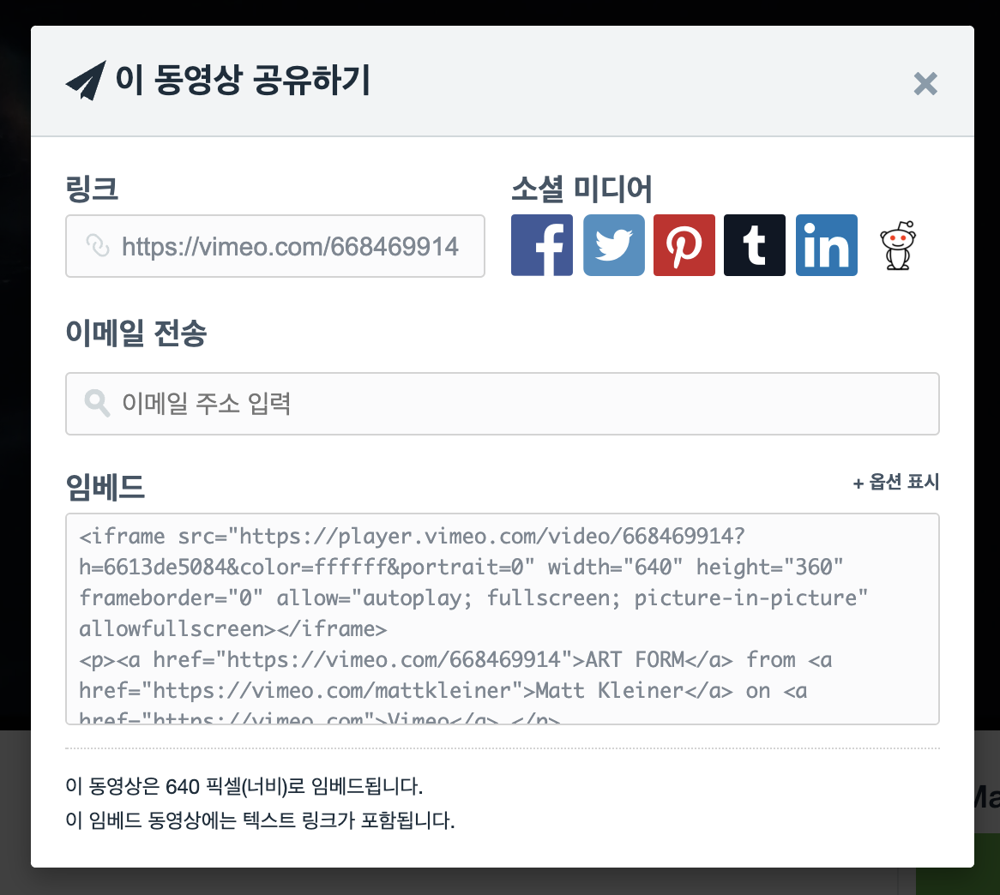
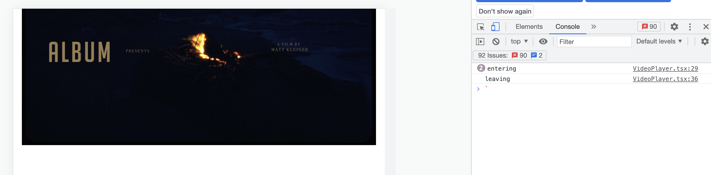
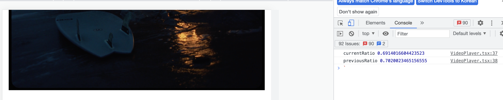
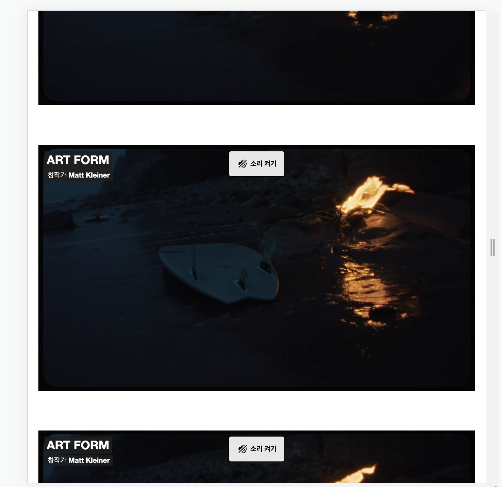
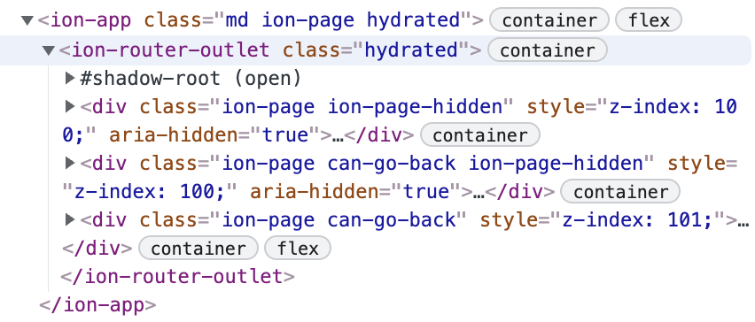

---

유튜브나 인스타그램을 보면 동영상이 내 화면에 나오면 자동으로 실행이 된다. 이번에는 동영상이 뷰에 들어오면 실행이 되고 뷰에서 벗어나면 멈추도록 하는 컴포넌트를 구현해보고자 한다.
특정 컴포넌트가 뷰에 노출이 된지 확인을 위해서는 `Intersection Observer API` 라는 WebAPI를 이용한다.

# IntersectionObserver

Intersection Obsever에 대한 설명은 다른 블로그나 공식 문서에서 자세하게 확인할 수 있다.
- [공식문서](https://developer.mozilla.org/ko/docs/Web/API/Intersection_Observer_API)
- [구글 검색 결과](https://www.google.com/search?q=intersection+observer&oq=intersection+observer&aqs=chrome.0.0i512l5j69i60l3.5956j0j9&sourceid=chrome&ie=UTF-8)

# Vimeo

비메오는 사용자가 직접 제작한 동영상을 업로드하고 공유하며 볼 수 있는 동영상 공유 서비스이다. Vimeo에 영상을 올리면 해당 영상에 접근할 수 있는 링크가 생성된다. Vimeo 영상 재생 페이지에 가면 공유 버튼을 찾을 수 있다. 공유 버튼을 누르면 아래와 같은 모달이 뜨는데, 여기서 임베드를 보면 `iframe` 태그를 통한 공유를 확인할 수 있다. 영상 링크만 있으면 된다. 임베드 시에 추가할 수 있는 설정에 대한 정보는 [여기서](https://developer.vimeo.com/player/sdk/embed) 확인할 수 있다.


## Vimeo SDK 추가

나는 Vimeo 영상을 이용해서 예제 코드를 작성할 예정이다. 물론 youtube([iframe api 문서](https://developers.google.com/youtube/iframe_api_reference?hl=ko)) 등 다른 동영상 플랫폼을 이용해도 된다.
Vimeo는 친절하게도 vimeo 영상을 control할 수 있는 sdk를 제공한다.([문서](https://developer.vimeo.com/player/sdk/basics)) CDN을 통해서 load할 수도 있고, npm SDK로 설치할 수 있다. 나는 CDN을 통해 사용해보겠다.

`<script async src="https://player.vimeo.com/api/player.js"></script>` 코드를 `index.html`에 삽입해주자.
`Vimeo`라는 객체를 사용하기 때문에, `types.d.ts` 파일을 만들어 아래와 같이 타입을 정의해주자

```ts
declare var Vimeo: any;
```

## 공유 링크 유의사항

### muted
Vimeo에서 공유 링크를 만들 때, `muted` 옵션을 1로 주어야 한다. 타 서비스에서 자동 실행되는 영상을 보면 다들 음소거 된 상태인 것을 알 수 있다. 이는 사용자 경험을 위한 브라우저 정책이다. 아래와 같은 형태에 원하는 옵션을 주면 된다

```
"https://player.vimeo.com/video/668469914?h=6613de5084&color=ffffff&portrait=0&muted=1"
```

### Height, Weight
Vimeo 임베드 공유 코드를 생성할 때, height, weight 속성을 없애준다. iframe에 인라인으로 height와 weight 속성이 있으면 해당 사이즈로 랜더링 되기 때문에 의도치않은 여백이 생긴다. 이 글에서는 영상 비율이 가로 세로 9:16이라고 가정한다.

# VideoPlayer 컴포넌트 구현

구현하고자 하는 VideoPlayer 컴포넌트는 아래의 기능 요건을 충족해야한다.

1. 화면에서 30% 이상 보이면 자동 실행.
2. 화면에서 30% 미만으로 보이는 경우에는 자동 일시 정지.

## 빈 VideoPlayer 컴포너트 구현

먼저 VideoPlayer라는 빈 컴포넌트를 작성한다. 프로젝트는 cra를 이용해서 생성했고, styling은 emotion을 이용한다.

```tsx
// VideoPlayer.tsx
import React from "react";
import { VideoPlayerContainer } from "./VideoPlayer";

interface IVideoPlayerProps {
  videoUrl: string;
}

export const VideoPlayer: React.FC<IVideoPlayerProps> = function VideoPlayer({
  videoUrl,
}) {
  return (
    <VideoPlayerContainer>
      <iframe src={videoUrl} suppressContentEditableWarning={true} />
    </VideoPlayerContainer>
  );
};
```

```ts
// VideoPlayer.styls.ts
import styled from "@emotion/styled";

export const VideoPlayerWrapper = styled.div`
  position: relative;
  width: 100%;
  height: auto;
  padding-top: calc(9 / 16 * 100%); // 기본 비율을 가로, 세로 9:16으로 한다.
  iframe {
    position: absolute;
    top: 0;
    left: 0;
    width: 100%;
    height: 100%;
  }
`;
```

VideoPlayer의 Wrapper 컴포넌트는 위와 같이 작성한다. 굳이 `position:relative`와 `padding-top` 속성을 준 이유는, 화면의 width에 맞게 영상의 가로 길이를 설정하기 위해서다.

## IntersectionObserver 연결

IntersectionObserver가 VideoPlayer를 observer할 수 있도록 VideoPlayer 컴포넌트 내부에 있는 iframe 엘리먼트에 연결한다. VideoPlayer가 랜더될 때, 한번만 연결 하면 된다.

```tsx
import React, { useEffect, useRef } from "react";
import { VideoPlayerContainer } from "./VideoPlayer.style";

interface IVideoPlayerProps {
  videoUrl: string;
}

export const VideoPlayer: React.FC<IVideoPlayerProps> = function VideoPlayer({
  videoUrl,
}) {
  const iframeRef = useRef<HTMLIFrameElement>(null);
  const observer = useRef<IntersectionObserver>();
  const handleIntersection = () => {
    console.log("handleIntersection called");
  };

  /**
   * iframeRef.current 를 observe 하도록 한다.
   * VideoPlayer 컴포넌트의 0.3, 0.7 지점을 지날 때 마다 handleIntersection이 호출되는 것을 확인할 수 있다.
   */
  useEffect(() => {
    if (iframeRef.current) {
      if (!observer.current) {
        observer.current = new IntersectionObserver(handleIntersection, {
          threshold: [0.3, 0.7],
        });
        iframeRef.current && observer.current.observe(iframeRef.current);
      }
    }
  }, [iframeRef.current]);

  return (
    <VideoPlayerContainer>
      <iframe
        src={videoUrl}
        suppressContentEditableWarning={true}
        ref={iframeRef}
      />
    </VideoPlayerContainer>
  );
};
```

## handleIntersection 구현

`VideoPlayer` 컴포넌트의 30%, 70% 만큼 보여졌을 때, `handleIntersection`이 호출되는 것을 확인했다. 이제 실제 `handleIntersection`을 구현해야한다. `IntersectionObserver()` constructor는 첫번째 파라미터로 callback 함수를 받는다. 공식 문서에 따르면 callback함수는 `IntersectionObserverEntry` 리스트와 `observer`를 인자로 받는다. 아래와 같은 형태로 구현이 된다.

```ts
let callback = (
  entries: IntersectionObserverEntry[],
  observer: IntersectionObserver
) => {
  entries.forEach((entry) => {});
};
```

`IntersectionObserverEntry`는 여러 property를 가지고 있는데, 모두 사용할 필요는 없으므로 작성한 코드와 함께 사용된 property에 대해 간단히 설명하겠다. 자세한 내용은 [공식문서](https://developer.mozilla.org/ko/docs/Web/API/Intersection_Observer_API)에서 쉽게 확인할 수 있다.

구현 전에 고려해야할 것이 있는데 현재 `IntersectionObserver`를 생성할 때, `threshold`를 `[0.3, 0.7]` 로 주었다. 이렇게 되면 아래의 경우가 가능하게 된다.

1. 위에서 아래로 스크롤 하며 Viewport에 컴포넌트가 보여질 때
2. 위에서 아래로 스크롤 하며 Viewport에서 벗어날 때
3. 아래서 위로 스크롤 하며 Viewport에 컴포넌트가 보여질 때
4. 아래서 위로 스크롤 하며 Viewport에서 벗어날 때

여기서 스크롤의 방향 여부에 따라 동작이 달라지지 않기 때문에, 컴포넌트가 보여질때와 벗어날 때만 구분을 하면 된다. 이를 위해 intersection이 발생할 때의 영역을 저장했다가, 다음 intersection이 발생했을 때 비교하여 viewport에 진입하고 있는지, 벗어나고 있는지를 구분한다. 구현 코드는 아래와 같다.

```ts
const previousRatio = useRef<number>(0); // 초기값은 0으로 한다.

const handleIntersection = (
  entries: IntersectionObserverEntry[],
  observer: IntersectionObserver
) => {
  entries.forEach((entry) => {
    const { intersectionRatio: currentRatio, isIntersecting } = entry;
    // Scrolling down/up
    if (isIntersecting) {
      if (currentRatio > previousRatio.current) {
        // 이전에 보여지고 있던 영역보다 현재 시점의 영역이 더 크면 VideoPlayer가 viewport에 진입하고 있는 것으로 판단
        console.log("entering");
      } else {
        // 이전에 보여지고 있던 영역보다 현재 시점의 영역이 더 작으면 VideoPlayer가 viewport에서 벗어나고 있는 것으로 판단.
        console.log("leaving");
      }
    }
    previousRatio.current = currentRatio;
  });
};
```

## Vimeo Handling 코드 구현

먼저 Vimeo Player 객체에 iframe을 연결한다. 공식 문서의 예제를 참고한다.

```ts
const player = useRef<any>(null);

useEffect(() => {
  if (iframeRef.current) {
    player.current = new Vimeo.Player(iframeRef.current);
  }
}, [iframeRef.current]);
```

`handleInteraction`을 다음과 같이 수정한다

```ts
const handleIntersection = (
  entries: IntersectionObserverEntry[],
  observer: IntersectionObserver
) => {
  entries.forEach(async (entry) => {
    const { intersectionRatio: currentRatio, isIntersecting } = entry;
    // Scrolling down/up
    if (isIntersecting) {
      if (currentRatio > previousRatio.current) {
        // Viewport 진입하는 경우
        const isPaused = await player.current.getPaused(); // 영상이 일시정지 상태인지 확인한다.
        if (isPaused) {
          // 일시 정지 상태이면 영상을 실행한다
          player.current.play();
        }
      } else if (currentRatio < previousRatio.current) {
        // Viewport 벗어나는 경우

        const isPaused = await player.current.getPaused();
        if (!isPaused) {
          // 재생중이면 영상을 일시정지 한다.
          player.current.pause();
        }
      }
    }
    previousRatio.current = currentRatio;
  });
};
```

위와 같이 작성하면 `VideoPlayer` 컴포넌트가 어느 정도 의도한 데로 동작하는 것을 확인할 수 있다. 하지만 자세히 보면 뭔가 이상하다는 것을 알 수 있다.

Viewport에서 벗어날 때, 30%가 아닌 70%가 남은 경우에 영상이 멈춘다. 예상대로라면 `previousRatio.current`도 0.7, `currentRatio`도 0.7이기 때문에 아무것도 실행되지 않아야 정상이다. 각 값을 찍어 확인하면 아래 처럼 찍히는 것을 확인할 수 있다.


왜 이런 값이 찍히는걸까?

## Intersection Observer의 비동기성

문서에 보면 이런 내용이 있다.

> 정확히 몇 픽셀이 겹쳐졌고 어떠한 픽셀이 겹쳐졌는지 Intersection Observer API 가 알려줄 수 없습니다. 그러나 "N% 정도 교차하는 경우 상호작용이 이루어져야한다." 와 같은 더 일반적인 사용 사례를 다룰 수 있습니다.

Intersection Observer는 비동기적으로 loop를 돌면서 DOM 엘리먼트를 관찰한다. 브라우저의 랜더링 속도만큼 빠르게 돌면서 관찰하지만 매번 스크롤의 위치가 0.0001%의 오차도 없이 동일할 수는 없다. 경우에 따라 intersection ratio가 0.7보다 크거나 작은 값인걸 확인할 수 있고, 그 차이가 0.01 내외라는 것을 확인할 수 있다. 정확하게 파악은 힘들지만 Interesction Observer의 비동기성으로 인해 실제 intersaction ratio가 threshold와는 완전히 동일하지 않고 이로 인해 의도하지 않은 동작을 하고 있다는 것을 확인했다.

## intersection ratio 조건 추가

`handleIntersection`을 아래와 같이 수정한다.

```ts
const handleIntersection = (
  entries: IntersectionObserverEntry[],
  observer: IntersectionObserver
) => {
  entries.forEach(async (entry) => {
    const { intersectionRatio: currentRatio } = entry;
    // Scrolling down/up
    if (currentRatio > previousRatio.current && currentRatio > 0.25) {
      // Viewport 진입하는 경우
      const isPaused = await player.current.getPaused(); // 영상이 일시정지 상태인지 확인한다.
      if (isPaused) {
        // 일시 정지 상태이면 영상을 실행한다
        player.current.play();
      }
    } else if (currentRatio < previousRatio.current && currentRatio < 0.35) {
      // Viewport 벗어나는 경우

      const isPaused = await player.current.getPaused();
      if (!isPaused) {
        // 재생중이면 영상을 일시정지 한다.
        player.current.pause();
      }
    }
    previousRatio.current = currentRatio;
  });
};
```

먼저 callback을 감싸고 있던 `if(isIntersecting){...}` 조건문이 사라졌다. 컴포넌트가 Viewport를 벗어날 때는 `isIntersection`이 false가 되기 때문이다. callback은 intersection threshold를 지날 때마다 호출되고 해당 시점마다 `handlieIntersection`가 호출되어야 한다.

그리고 각 Viewport에 진입하는 경우에 `intersectionRatio`가 `0.25` 보다 큰지 확인한다. `threshold`의 값이 `0.3`이기 때문에 `0.05`의 범위를 주었다. Viewport에서 벗어나는 경우도 마찬가지로 `0.05`의 범위를 주어 threshold를 지나는 순간 `intersectionRatio`가 `0.35`보다 작은지를 확인하도록 했다.

## 코드 정리

기능 구현이 완료 되었으니, 이제 코드를 분리해보자.
현재 `handleIntersection`에 진입시 동작 코드와 벗어날 경우 동작 코드가 같이 있다. 나는 각 경우에 대해 커스텀 이벤트를 발생시키고 ifame Element에 커스텀 이벤트 리스너를 추가하여 해당 이벤트가 발생한 경우에 필요한 동작을 하도록 할것이다. 전체 구현 코드는 아래와 같다.

```tsx
// VideoPlayer.tsx
import React, { useEffect, useRef } from "react";
import { VideoPlayerContainer } from "./VideoPlayer.style";

interface IVideoPlayerProps {
  videoUrl: string;
  className: string;
}

const VIDEO_PLAY_EVENT = "playVideo";
const VIDEO_PAUSE_EVENT = "pauseVideo";

export const VideoPlayer: React.FC<IVideoPlayerProps> = function VideoPlayer({
  videoUrl,
  className,
}) {
  const iframeRef = useRef<HTMLIFrameElement>(null);
  const observer = useRef<IntersectionObserver>();
  const previousRatio = useRef<number>(0);
  const player = useRef<any>(null);

  const handlePlayVideo = async (e: Event) => {
    const isPaused = await player.current.getPaused(); // 영상이 일시정지 상태인지 확인한다.
    if (isPaused) {
      // 일시 정지 상태이면 영상을 실행한다
      player.current.play();
    }
  };
  const handlePauseVideo = async (e: Event) => {
    const isPaused = await player.current.getPaused();
    if (!isPaused) {
      // 재생중이면 영상을 일시정지 한다.
      player.current.pause();
    }
  };

  const handleIntersection = (
    entries: IntersectionObserverEntry[],
    observer: IntersectionObserver
  ) => {
    entries.forEach(async (entry) => {
      const { intersectionRatio: currentRatio } = entry;
      if (currentRatio > previousRatio.current && currentRatio > 0.25) {
        // Viewport 진입하는 경우
        entry.target.dispatchEvent(new CustomEvent(VIDEO_PLAY_EVENT));
      } else if (currentRatio < previousRatio.current && currentRatio < 0.35) {
        // Viewport 벗어나는 경우
        entry.target.dispatchEvent(new CustomEvent(VIDEO_PAUSE_EVENT));
      }
      previousRatio.current = currentRatio;
    });
  };

  useEffect(() => {
    if (iframeRef.current) {
      player.current = new Vimeo.Player(iframeRef.current);
    }
  }, [iframeRef.current]);

  /**
   * iframeRef.current 를 observe 하도록 한다.
   * index.html에 viewport는 <div id="root"> 엘리먼트 이기 떄문에 root를 지정한다.
   */
  useEffect(() => {
    if (iframeRef.current) {
      if (!observer.current) {
        observer.current = new IntersectionObserver(handleIntersection, {
          threshold: [0.3, 0.7],
        });
        iframeRef.current && observer.current.observe(iframeRef.current);
      }
    }
  }, [iframeRef.current]);

  /**
   * iframe 엘리먼트에 비디오 시작, 일시 정지를 위한 커스텀 이벤트리스너 추가
   */
  useEffect(() => {
    const iframeEl = iframeRef.current;
    if (iframeEl) {
      iframeEl && iframeEl.addEventListener(VIDEO_PLAY_EVENT, handlePlayVideo);
      iframeEl &&
        iframeEl.addEventListener(VIDEO_PAUSE_EVENT, handlePauseVideo);
    }
    return () => {
      if (iframeEl) {
        iframeEl.removeEventListener(VIDEO_PLAY_EVENT, handlePlayVideo);
        iframeEl.removeEventListener(VIDEO_PAUSE_EVENT, handlePauseVideo);
      }
    };
  }, []);

  return (
    <VideoPlayerContainer className={className}>
      <iframe
        src={videoUrl}
        suppressContentEditableWarning={true}
        ref={iframeRef}
      />
    </VideoPlayerContainer>
  );
};
```

```ts
// VideoPlayer.styles.ts
import styled from "@emotion/styled";

export const VideoPlayerContainer = styled.div`
  position: relative;
  width: 100%;
  height: auto;
  padding-top: calc(9 / 16 * 100%);
  iframe {
    position: absolute;
    top: 0;
    left: 0;
    width: 100%;
    height: 100%;
  }
`;
```

# 유의사항
## 동일한 페이지에 여러 개의 영상이 있는 경우

하나의 페이지에 여러 개의 영상을 보여주는 경우에 유의해야한다. vimeo의 경우에는 `background` 옵션을 줄 수 있다. `background` 옵션을 `1`로 주면 동일한 페이지에서 여러 개의 영상이 실행되는 불상사가 발생할 수 있다. 반면에 하나의 페이지에 여러 개의 영상이 있는데 `background`를 `0`으로 주면 조금 이상하게 동작할 수 있다.

위와 같은 상황에서 일반적으로 가운데 영상이 실행되어야 한다. 하지만 스크롤을 내리다가 다시 올리거나, 올리다가 다시 내리면 가운데 영상이 실행되지 않고 가장 아래(또는 위)의 영상이 실행되는 것을 확인할 수 있다. 현재 구현된 코드에서는 Viewport에 비디오가 진입하는 시점에 해당 비디오를 실행시키는데, `background` 옵션이 `0`이면 동일한 페이지에서는 하나의 영상만 실행이 가능하기 때문에 화면 가운데에서 실행되는 비디오가 멈추게 된다. 이 부분은 경우에 따라 추가 구현이 필요하다

## 페이지 이동이 발생하는 경우

웹앱(하이브리드앱)인 경우에 고려해야하는 사항이다. 앱에서 웹뷰를 이용하는 경우에 페이지 이동시 해당 페이지가 언마운트 되는것이 아니라 위에 추가될 수 있다. 모바일 UI 프레임워크인 `Ionic`을 사용하는 경우를 예시로 들면

위 이미지를 보면 클래스명이 `ion-page`인 엘리먼트가 3개가 있는 것을 볼 수 있다. `ion-page-hidden` 클래스가 있는 엘리먼트는 현재 보이지 않고 밑에 깔려있는 상태다. stack과 같이 가장 최근의 페이지가 위에 쌓이는 형태인 것이다. 만약 `VideoPlayer` 컴포넌트가 있는 페이지에서 다른 페이지로 이동하면서 위에 다른 페이지 엘리먼트가 쌓여도 `VideoPlayer` 컴포넌트는 언마운트되지 않았기 때문에 계속 실행되고 있는 상태이다. 사용자 입장에서는 다른 페이지로 이동했는데 영상 소리가 계속 나게 되는 것이다.

이러한 문제를 해결하기 위해서는 페이지 이동이 되는 시점에 실행되고 있는 영상을 일시정지 해주어야 한다. `Ionic`같은 경우에는 `useIonViewWillLeave` 훅을 사용해서 페이지에서 벗어나는 경우에 영상을 멈출 수 있다. 아마 다른 웹앱 UI 프레임워크도 동일한 기능이 있을 것이다. 예시는 아래와 같다.

```ts
/**
 * 다른 뷰로 라우팅 되면 영상 멈춤
 */
useIonViewWillLeave(() => {
  if (player.current) {
    player.current.getPaused().then((paused) => {
      if (!paused) {
        player.current.pause();
      }
    });
  }
}, []);
```

# 참고

https://stackoverflow.com/questions/61951380/intersection-observer-fails-sometimes-when-i-scroll-fast
https://developer.mozilla.org/ko/docs/Web/API/Intersection_Observer_API
https://stackoverflow.com/questions/60164596/how-to-embed-youtube-iframe-video-100-full-width
