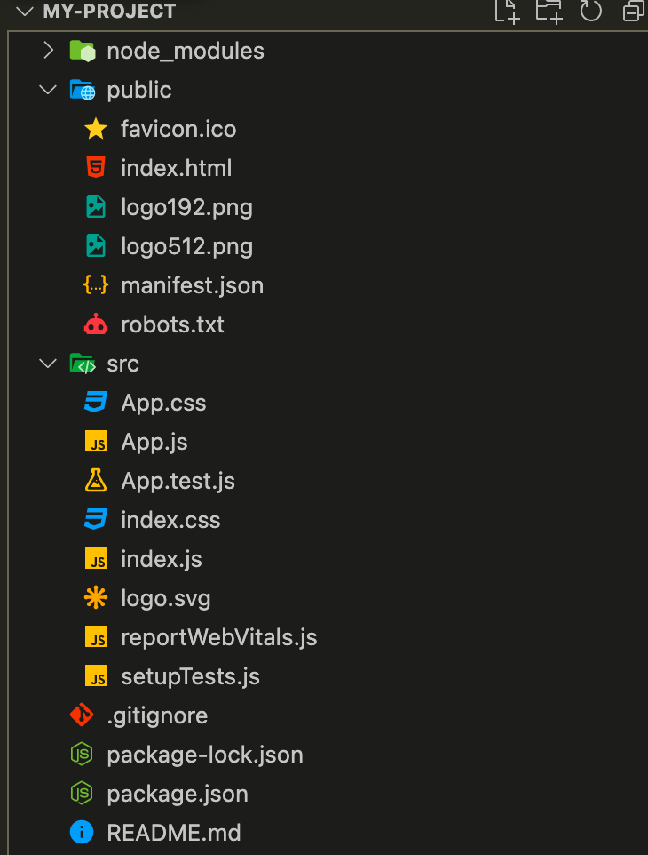
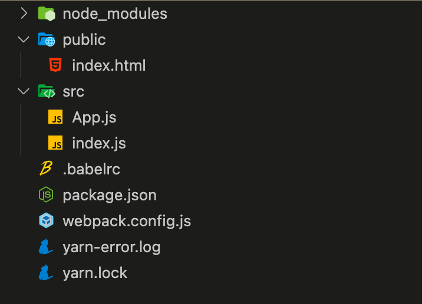
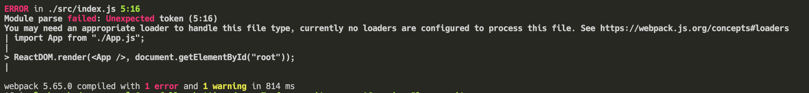

---

다음글 : __[CRA 없이 React 프로젝트 만들기(2)(w/Typescript)](../react-project-without-cra-2)__

해당 게시물에 사용된 프로젝트는 아래 깃헙 레포지토리에서 확인할 수 있다.

[Github Repository](https://github.com/21hak/no-cra)

# create-react-app

CRA(Create React App)는 Facebook 팀에서 만든 리액트 프로젝트를 시작하기 위한 도구이다. 사용법은 정말 간단한데, 폴더를 하나 만든 뒤에 `create-react-app [프로젝트명]` 으로 명렁어를 실행하면 된다. `create-react-app`도 하나의 패키지기 때문에 미리 설치를 해야한다.

```shell
# create-react-app 설치
# npm
npm install -g create-react-app

# yarn
yarn add create-react-app
```

아래와 같이 프로젝트를 생성할 수 있다.

```shell
# create-react-app으로 리액트 프로젝트 생성
npx create-react-app my-project
```

`create-react-app`을 사용하면 리액트 앱 개발에 필요한 설정들이 된 프로젝트가 생성된다.


# create-react-app 없이 만들어보자

CRA를 통해 복잡한 설정 없이 프로젝트를 만들 수 있지만, 실제 서비스로 사용되는 React 앱들은 보다 복잡한 설정이 필요하다. 따라서 CRA를 사용하기 보다는 직접 하나씩 추가하면서 이것 저것 설정을 커스텀하게 하는 경우가 많다. 그럼 하나씩 처음부터 해보자.

## 1. 프로젝트 폴더 생성 및 package.json 생성

프로젝트 폴더를 먼저 만든 뒤, npm이나 yarn을 이용해서 `package.json`을 생성한다. 나는 yarn을 사용한다.

```shell
mkdir no-cra
cd np-cra
yarn init # or yarn init --y
```

## 2. 기본 폴더 구조

아래와 같이 기본적으로 필요한 폴더 및 파일을 생성한다. `index.html`은 SPA(Single Page Application)가 기본인 react 앱에서 실제 Single Page를 구성하는 html파일이다. `index.js`는 프로젝트의 엔트리 포인트가 되는 JS 파일이다. `App.js`는 리액트 앱의 가장 부모 컴포넌트로 Root Component가 된다. 이 `App` 컴포넌트를 바탕으로 여러 컴포넌트가 쌓이고 동작하게 된다.


`index.html`은 필수 태그만 포함시키고 뼈대만 추가한다.

```html
<!DOCTYPE html>
<html lang="ko">
  <html>
    <head>
      <meta charset="UTF-8" />
      <meta name="viewport" content="width=device-width, initial-scale=1.0" />
      <title>리액트 앱을 만들어보자</title>
    </head>
    <body>
      <div id="root" />
    </body>
  </html>
</html>
```

`index.js`는 `App` 컴포넌트를 랜더링 하도록 한다.

```jsx
import React from "react";
import ReactDom from "react-dom";
import App from "./App";

ReactDom.render(<App />, document.getElementById("root"));
```

`App.js`는 간단하게 헬로 월드만 `<div>` 태그로 감싸서 보여준다.

```js
import React from "react";
function App() {
  return <div> Hello from React World </div>;
}
export default App;
```

자 여기 까지 했으니, 이제 슬슬 한번 실행을 시켜서 화면을 보고 싶다. 실행을 시키려면 명령어가 필요하다.
`package.json`으로 가서 명령어 설정을 추가하자. 일단 리액트 앱을 빌드를 시킬 도구가 없으니, 빌드 명령어는 비워놓는다.

```json
{
  ...
  "scripts": {
    "dev": ""
  },
   ...
}

```

## Webpack 설정

빌드를 한다는 것은 작성된 리액트 앱을 자바스크립트 런타임(node.js)이 실행할 수 있도록 변환을 해서 실행한다는 것을 의미한다. 나는 `webpack`을 사용해서 리액트 앱을 번들로 만들고 그 번들을 `webpack-dev-server`라는 로컬에서 돌아가는 개발 서버로 실행시킬 것이다. `webpack-dev-server`는 소스 파일들을 번들링 한 뒤에, 소스파일이 변경 되면 자동으로 새로 번들링해서 반영시켜주는 녀석이다.

### webpack 설치

webpack과 터미널에서 명령어를 날릴 때 사용되는 webpack-cli 그리고 로컬에서 개발할 때 사용할 webpack-dev-server을 설치한다.

```shell
yarn add --dev webpack webpack-cli webpack-dev-server
```

### webpack.config.js

자세한 웹팩 설정은 [공식 문서](https://webpack.kr/concepts/)를 참고한다.

```js
const path = require("path");
const HtmlWebpackPlugin = require("html-webpack-plugin");

module.exports = {
  entry: "./src/index.js", // 웹팩 빌드 시작점
  mode: "development",
  output: {
    filename: "main.js", // 빌드 후 결과 파일 명
    path: path.resolve(__dirname, "dist"),
  },

  plugins: [
    new HtmlWebpackPlugin({
      // public/index.html에 웹팩으로 빌드한 모듈을 넣어줌
      template: path.resolve(__dirname, "public/index.html"),
    }),
  ],
  devServer: {
    // 개발 서버에 대한 설정.
    static: path.join(__dirname, "public/"), // public/ 밑에 있는 파일을 경로를 asset으로 보여준다.
    port: 3000,
    hot: true,
  },
};
```

### package.json script 추가

```json
"scripts": {
    "dev": "webpack serve", // webpack-dev-server를 실행한다
    "build": "webpack --progress --mode production" // 웹팩으로 빌드를 해서 빌드 파일을 생성한다.
  },
  
```

자, 이제 실행을 위한 빌드를 위한 webpack 설정까지 했으니 실행을 해보자. 터미널에 당당하게 `yarn run dev` 를 입력한다.

위와 같은 알아들을 수 없는 에러가 발생하는데, 찬찬히 보면 왜 일어나는지 대충 알 수 있다.
먼저 index.js에서 5번째줄 16번째 단어에서 에러가 발생했다고 뜬다. `index.js`에서 해당 위치를 보니 `<`이 문자에서 에러가 난다고 한다. webpack이 번들링을 하려고 하는데 해당 문자를 모르겠으니, 이걸 처리할 수 있는 적절한 loader를 추가하라는 것이다.

`<App/>` 과 같은 문법은 `JSX` 문법이다. `JSX(Javascript XML)` 문법은 react에서 사용하는 문법으로 공식적인 Javascript 문법이 아니다. 실제로 `JSX` 문법을 이용한 컴포넌트 표현은 바벨과 같은 Transpiler를 통해 `React.createElement()` 호출로 컴파일 되어야 한다.

```js
const element = <h1 className="greeting">Hello, world!</h1>;
```

위 코드는 아래 코드로 변환이 된다. [react공식문서](https://ko.reactjs.org/docs/introducing-jsx.html)

```js
const element = React.createElement(
  "h1",
  { className: "greeting" },
  "Hello, world!"
);
```

ㅇㅋ 바벨도 추가하자

## Babel

바벨을 이용해서 `JSX`와 같은 문법을 javascript로 변경(Transpile)한 뒤에, webpack으로 번들링 한다.

### Babel 설치

Babel의 transpile 로직을 담당하는 `@babel/core`, Babel의 transpile 설정을 하나하나 하지 않고 세트로 묶어서 할 수 있도록 하는 `@babel/preset-env`, Babel에게 react는 어떻게 transpile할지 알려줄 `@babel/preset-react` 그리고 webpack이 babel을 사용할 수 있도록 하는 `babel-loader`를 설치한다.

```shell
yarn add --dev @babel/core @babel/preset-env  @babel/preset-react babel-loader
```

### .babelrc 설정

아래와 같이 설정한다

```json
{
  "presets": ["@babel/preset-env", "@babel/preset-react"]
}
```

### webpack.config.js 수정

웹팩에게 특정 파일들에 대해서 어떻게 처리를 할지 알려줘야 한다. `webpack.config.js`의 `module`설정을 통해 `js` 파일들은 `babel-loader`를 이용하도록 한다. 설정에 대한 내용은 [공식 문서](https://webpack.js.org/configuration/module/)을 참고한다.

Babel 설정까지 마치고 난 뒤, `yarn run dev`를 실행하면 잘 동작하는 것을 확인할 수 있다. `yarn run build`를 실행하면 설정한 대로 `dist/main.js`와 생성된 `main.js`를 `<script>` 태그로 load하고 있는 `index.html`이 생성된 것을 확인할 수 있다.

# Typescript

여기까지 CRA 없이 리액트 프로젝트를 구성하고 webpack을 이용하여 빌드까지 해보았다. 실행을 위해 아주 간단한 설정들만 했기 때문에, 실제 서비스에 사용하기에는 많이 부족하다. 다음 단계로 해당 프로젝트에 Typescript를 추가해보고자 한다. Typescript를 추가한 뒤, 기회가 되면 webpack, babel 설정을 좀 더 고도화 해보겠다.
