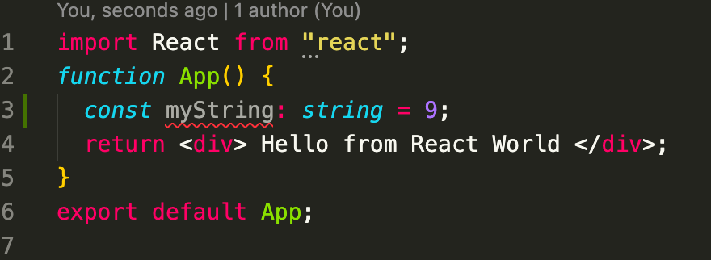
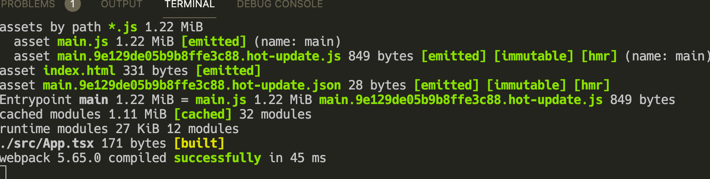
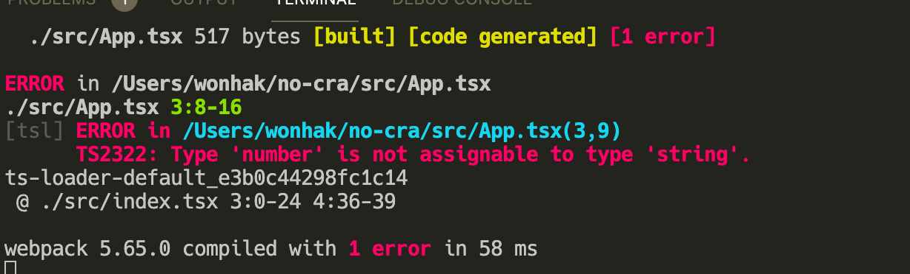

이전글 : __[CRA 없이 React 프로젝트 만들기(2)(w/Typescript)](../react-project-without-cra-2)__

해당 게시물에 사용된 프로젝트는 아래 깃헙 레포지토리에서 확인할 수 있다.

https://github.com/21hak/no-cra/tree/typescript-ts-loader

# ts-loader

https://github.com/TypeStrong/ts-loader
Webpack에 사용되는 Typescript loader다. `Babel`은 본래 크로스 브라우징을 위한 transpiler의 기능을 목적으로 했지만, Typescript가 등장하며 `babel-loader`와 `@babel/preset-typescript`을 이용해 typescript를 javascript로 transpile하는 기능을 갖추었다. `ts-loader`는 webpack과 함께 typescript를 사용하기 위한 loader다.

# ts-loader를 사용해보자

먼저 `ts-loader`를 설치한다.

```shell
yarn add --dev ts-loader
```

이전에 설치되어 있던 `Babel`관련 depedency는 모두 제거해준다. `.babelrc` 파일도 제거한다.

```shell
yarn remove babel-loader @babel/core @babel/preset-env @babel/preset-react
```

`webpack.config.js`를 아래와 같이 수정한다. `babel-loader` 대신 `ts-loader`를 이용해서 `.tsx`, `.ts` 파일을 transpile한다.

```js
...
module: {
    rules: [
      {
        test: /\.tsx?$/,
        include: [path.resolve(__dirname, "src")],
        use: ["ts-loader"],
      },
    ],
  },
...
```

`tsconfig.json` 파일을 아래와 같이 작성한다. [ts-loader 문서](https://github.com/TypeStrong/ts-loader)에 따르면 `ts-loader`는 `tsconfig.json` 파일 설정을 따른다. 즉 `ts-loader`를 사용하는 경우 `tsconfig.json`이 IDE의 typescript 설정, tsc 커맨드, 그리고 `ts-loader`의 설정을 모두 관리하게 된다.

```json
{
  "compilerOptions": {
    "target": "es6",
    "module": "es6",
    "moduleResolution": "node",
    "jsx": "react",
    "sourceMap": true
  },
  "include": ["src"],
  "exclude": ["node_modules"]
}
```

`tsconfig.json`의 옵션에 대한 설명은 [typescript 공식문서](https://www.typescriptlang.org/tsconfig)에서 확인할 수 있다. 위 속성에 대해 간단히 설명하면 `target`은 typescript가 transpile될 javascript의 명세 버전을 설정한다. `es6`로 설정하면 `es6`명세를 따르는 javascript로 transpile 된다.

`module`은 transpile된 javascript가 따를 module system을 정한다. 공식 문서에 따르면 `target`이 `es3` 또는 `es5`인 경우에 `CommonJs`로 설정하고 그 외에는 `es6`나 `es2015`로 설정하는걸 추천한다. Webpack과 사용하는 경우에 `es6`에 사용되는 `import`를 이용해야 `tree shaking`이 이루어지기 때문에 유의해야한다.

`moduelResolution`은 import되는 모듈의 위치를 찾기 위한 전략을 선택하는 옵션이다. `classic` 또는 `node`를 선택할 수 있다. 이에 대한 설명은 https://typescript-kr.github.io/pages/module-resolution.html서 자세히 확인할 수 있다.

`jsx`는 `JSX` 문법이 어떻게 변경될 지를 설정한다. 우리는 `react`를 사용하기 때문에 `JSX`는 `React.createElement`로 변경되어야 한다. 따라서 `react`로 설정한다.

`sourceMap`은 sourcemap files를 생성하도록 한다. sourcemap files들은 구글 개발자 도구와 같은 debugging tool에서 transpile 이전의 typescript 소스 코드를 확인할 수 있게 해준다.

# ts-loader vs babel-loader

Webpack과 함께 typescript를 사용하기 위해서는 `ts-loader` 또는 `Babel`을 이용해야 한다. 그렇다면 둘 중 어느 것을 사용해야 할까?

## Type Checking

`Babel`은 type checking을 하지 않는다.

```ts
const myString: string = 9;
```


위와 같은 코드를 작성하면 vscode에서는 빨간 줄이 생기면서 type에 대한 오류를 보여준다. 하지만 `babel-loader` 사용 시 아래와 같이 실제 터미널에서는 문제 없이 돌아간다.

`babel-loader`를 이용하면서 type checking을 하고 싶다면 [`fork-ts-checker-webpack-plugin`](https://github.com/TypeStrong/fork-ts-checker-webpack-plugin)을 사용하면 된다. `fork-ts-checker-webpack-plugin`는 background process로 type checking을 진행하기 때문에 컴파일 속도 저하에 크게 영향을 주지 않으며 type checking을 할 수 있다.

반면에 `ts-loader`는 기본적으로 type checking을 한다. type checking 없이 transpile만 하고 싶은 경우 `transpileOnly` 옵션을 true로 주면 `babel-loader`와 동일하게 type checking 없이 transpile만 진행한다.


## Performance

`ts-loader`는 기본적으로 type checking을 하기 때문에 `Babel`에 비해 속도가 느리다. 단, tsconfig에 `transplieOnly`를 추가하여 typechecking 기능을 뺀다면 속도에 대한 차이는 크게 없다.

```json
...
module: {
    rules: [
      {
        test: /\.tsx?$/,
        use: [
          {
            loader: "ts-loader",
            options: {
              transpileOnly: true,
            },
          },
        ],
        include: [paths.src],
      },
    ],
  },
...
```

`ts-loader`와 `babel-loader`의 차이를 비교해놓은 글이다. https://blog.logrocket.com/babel-vs-typescript/

# 정리

여기까지 CRA 없이 react 프로젝트를 구성해보았다. 빌드를 위해 webpack을 사용했으며 typescript를 적용하기 위해 `Babel` 또는 `ts-loader`를 이용했다. 구체적인 설정 방법은 나도 다 모르거니와, 필요에 따라 공식 문서를 참고하는 것이 더 좋다고 생각했다. 최소한 자신의 프로젝트가 어떤 설정을 가지고 빌드되는지, 그 과정은 어떻게 되며 각각 어떤 녀석들이 관여를 하는지 이해를 할 수 있는 좋은 시간이었다.

### 참고

- babel-loader vs ts-loader (https://blog.logrocket.com/babel-vs-typescript/)
- bable-loader vs ts-loader (https://github.com/woowa-techcamp-2021/store-4/wiki/babel-loader-%26-%40babel-preset-typescript-vs-ts-loader-%EA%B0%84%EB%8B%A8%ED%95%9C-%EC%A0%95%EB%A6%AC)
- ts-loader github (https://github.com/TypeStrong/ts-loader#transpileonly)
- webpack official document (https://webpack.js.org/concepts/)
- tsconfig options (https://www.typescriptlang.org/tsconfig)
- typescript module resolution (https://typescript-kr.github.io/pages/module-resolution.html)
